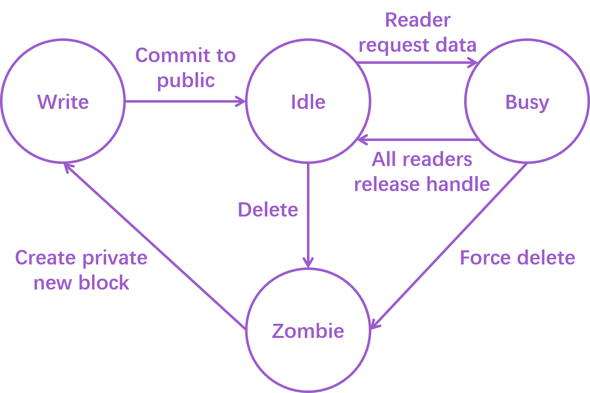

# SMOS

## Introduction to SMOS
SMOS is a lightweight shared memory object store written in Python, featuring high throughput and low latency.
It is specially optimized for reinforcement learning scenarios, where processes write large chunks of NumPy arrays
once but read them multiple times. SMOS can provide concurrent reads and writes of NumPy arrays with full RAM speeds
from more than 64 processes (i.e., it has very little control overheads). The high efficiency of SMOS comes in the
two ways, as shown in section ***Technical Details***.

## Installation
SMOS has been released as a python package to PyPI. It supports python>3.8 with linux. To install SMOS, simply run:

    pip install SMOS_antony

## Usage
TODO

## Technical Details

### Four Stage Transition model

SMOS is based on the four stage transition model shown above.
1. When a process issues a create-new-block command to the centralized SMOS server, it will get a new shared memory block 
   only visible to itself. The block it gets will be in `write` state. The process can write into the block whatever it likes.
   
2. Once the writer decides that all work is done with the block, it can issue a commit-to-public command to the SMOS server.
   After this command, the block will be visible to everyone on the same machine. Now the block is in `idle` state,
   since we have no pending readers on the block.

3. When a reader process wants the data from a particular block, it issues a request-data command to the SMOS server
   and will be replied with a handle to the target block. This command also makes the block `busy`.
   
4. After all readers finish the work with the block and release their handles, the block will return to `idel` state. 
   Stage 3 and 4 can happen multiple times during the whole lifespan of a block.
   
5. Once the block is no longer needed by anyone, some clean up process can issue a delete command (or force delete)
   that turns the block into a `zombie`. Note that SMOS does not delete the actual data on the block. Becoming a 
   `zombie` only means that the block ceases to be visible to processes other than the SMOS server.
   
6. The SMOS server will reuse and dispatch the `zombie` blocks to writers when they issue create-new-block commands.

This four stage design enables the underlying buffer to be lock-free. For any operation, the server critical path
only contains manipulation of meta-data, enabling very low control overhead.

**Special Notice:** Readers can still write to the blocks when they hold the handles in stage 3, but SMOS does not
provide data integrity guarantees for this kind of write operations. If this kind of writes are necessary, consider
adding a buffer lock on the 'reader' side. (SMOS provides an implementation of read-write fair lock in `src/SMOS_utils.py`)

### Special Optimizations for NumPy Arrays
SMOS is an interprocess communication tool with special optimizations for reinforcement learning (RL) scenarios.
We recognize that the data pattern of RL contains (1) single write and multiple reads of large NumPy arrays
, and (2) sharing of small complicated class objects. To address the first type of communication, we support
direct shared memory read of NumPy arrays in SMOS. NumPy arrays (or lists of NumPy arrays) can be passed between
processes without serialization and memory copy. To address the second type of communication, we add intrinsic
pickle and unpickle operations to objects with user defined class types. We tackle the two kinds of data differently,
which gives us better performance and broad data support range.